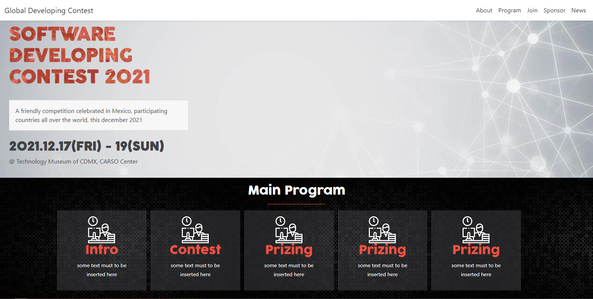

# Capstone project Module 1

> This capstone project is frontend related, using the templaete of Cindy Shin (thanks a lot Cindy), that you can visit in this url: https://www.behance.net/gallery/29845175/CC-Global-Summit-2015

> I hope you enjoy it.

This project is part of the Module 1 of microverse program.

## Built With

- Html, Sass, Css, Js
- Bootstrap

## Live Demo

[Live Demo Link](https://wikitelmex.github.io/capstone-module1/)

## Authors

👤 **Alex Castillo**

- GitHub: [@githubhandle](https://github.com/wikitelmex)

## Show your support

Give a ⭐️ if you like this project!

## Acknowledgments

- learned a lot about SASS and bootstrap

## 📝 License

This project is [MIT](./MIT.md) licensed.
